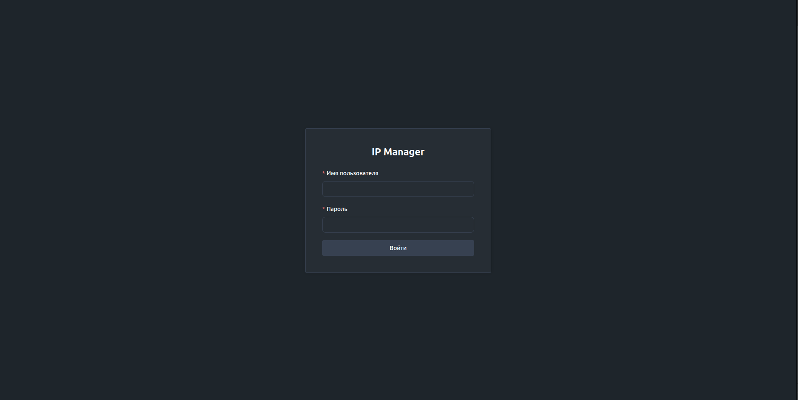
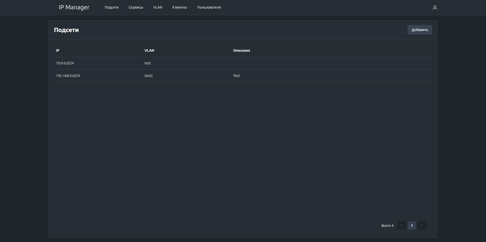
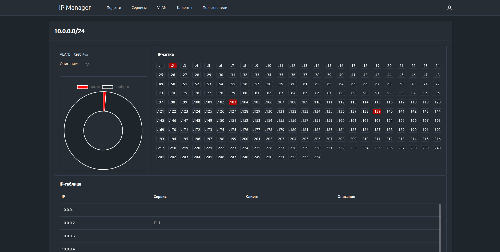

# IPManager - Простое управление IP-адресами

Инструмент для управления IP-адресами, подсетями, серверами, VLAN и клиентами.

При добавлении подсети (например, 10.0.0.0/24) автоматически генерируется IP-сетка с возможностью назначения IP-адресов
серверам или клиентам.

---

### Возможности

- Управление подсетями - автоматическая генерация IP-сетки при добавлении подсети
- Назначение IP-адресов - закрепление IP за серверами или клиентами

### Интерфейс приложения

<p align="center">
  
  
  
</p>

---

### Запуск приложения

```bash
docker-compose up -d
```

### Выполнение миграций базы данных и создание учетной записи администратора

```bash
docker-compose exec ipmanager ipmanager migrate
```

### Доступ к приложению

- URL: http://127.0.0.1:8000
- Имя пользователя: admin
- Пароль: admin123

